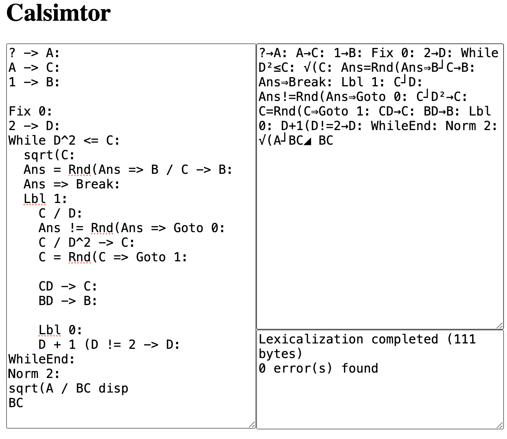
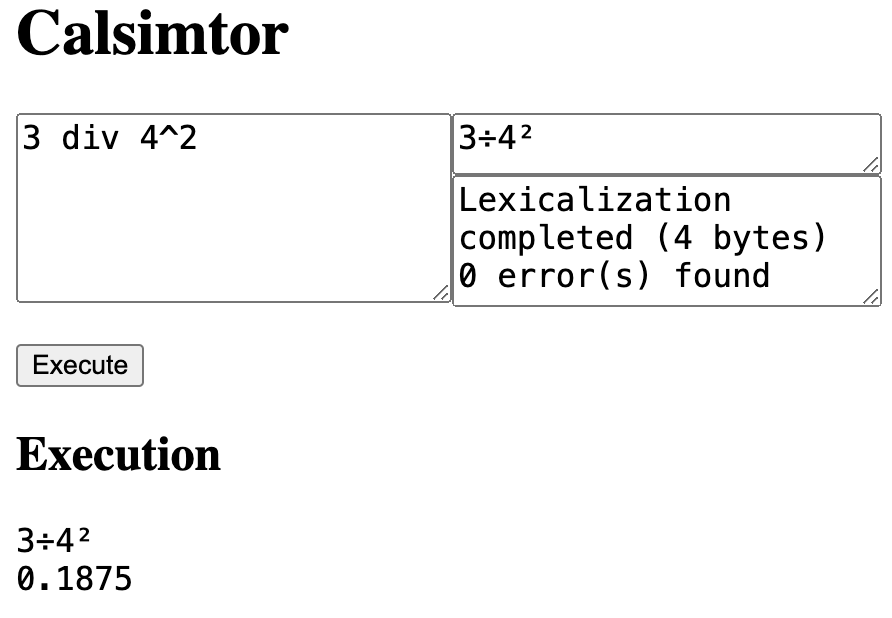
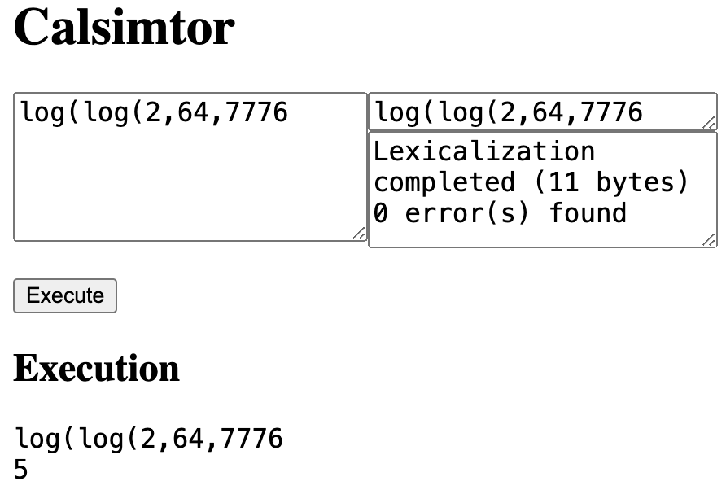

# Calsimtor
_"calculator simulator"_

An incomplete effort to reverse engineer the programming language of the CASIO fx-50FH II calculator.

This project is not in active development.
Contributions from those interested in this project are welcomed! See below.

## Implemented features
### Lexicalisation
This allows calculator programs to be written in more readable and easily typed source code.
Symbols can be typed in ASCII characters (e.g. the display token `◢` is represented by `disp`, the assignment token `→` is represented by `->`),
and spaces, line breaks and indents are allowed for better maintainability.

You can use the lexer by opening `index.html` in your browser.

**All COMP mode tokens are supported.**
This includes digits, variables, physical constants, operators, functions, setup commands, and program control flow symbols.
See `src/token-types.ts` for the full list.

### Evaluating expressions
Expressions refer to when mathematical computation is performed,
like using COMP mode and evaluating the left hand side of an assignment statement (e.g. `A+1→A`).

**Evaluation of COMP mode expressions are fully supported** and should agree with results obtained from the calculator
(with the sole exception of numerical precision, see [DOC.md](DOC.md)).
This includes:
- operator precedences;
- the command and numeric stacks, and therefore stack overflow errors;
- accurate error types and positions; and
- all COMP mode parenthetical functions (such as `log(`, `sin(`, `Pol(`).

You can type expressions into `index.html` and evaluate them by pressing "Execute".

See [DOC.md](DOC.md) for explanations of various mechanisms and `src/tests/expression.ts` for examples.
Evaluation of expressions are implemented in `src/expression.ts`.

### Interpreter
Interpreting refers to the execution of calculator programs, such as handling input/output and control flows.

**Limited control flow is supported.**
This includes:
- statement separator (`:`) and display (`◢`);
- prompting (`?→A`);
- assignment (`→`);
- conditional jump (`⇒`, "fat arrow"); and
- unconditional jump (`Lbl` and `Goto`).

You can type a program into `index.html` and press "Execute" to start running.
Press enter to continue after display.

https://github.com/user-attachments/assets/331f3668-17f0-4872-b69c-a60c0e3ae0a6

https://github.com/user-attachments/assets/6da9807c-b3bc-4e55-978e-7b0444db18e5

Again see [DOC.md](DOC.md) for explanations.
Refer to `src/tests/interpreter.ts` for examples.
Evaluation of expressions are implemented in `src/interpreter.ts`.

## Getting started
- Make sure `node.js`, `tsc`, and `webpack` is installed.
- Compile with `npm run build`.
- Tests for expression evaluation and interpreting can be run with `npm test`.
- If you want to use `index.html`, run `npm run bundle` first to bundle code together for web browser use.

## About this project
This programmable calculator is commonly used by Hong Kong students in the HKDSE examination.
In fact this project originated from converting one of my calculator programs into JavaScript for easier testing.

Since this simulator currently still has essential features missing (e.g. `If`, `For`, setup commands, REG mode),
most calculator programs will not run on this.
However the calculator has many weird quirks that are fun to explore.
`src/tests/` includes examples that can reveal a lot about its internal working.
[DOC.md](DOC.md) also documents known, implemented features of the calculator,
as well as some that I haven't implemented yet.

If you have insights in the project, please feel free to open an issue or submit a pull request.
